# Dropshipping Marketplace Workflow

## Overview
A multi-vendor dropshipping marketplace connects **admins, sellers, customers, and external suppliers** in one coordinated system. The platform supports product listing, variant management, order routing, fulfilment, returns, refunds, commissions, and seller payouts.

---

## User Roles

### 1) Admin
Responsible for platform governance, seller approval, operations control, dispute handling, wallet oversight, and reporting.

### 2) Seller
Manages store setup, product publishing, inventory or supplier mappings, order fulfilment, returns, and earnings.

### 3) Customer
Browses products, places orders, pays online, tracks shipments, submits reviews, and requests returns or refunds.

---

## High-Level Marketplace Flow

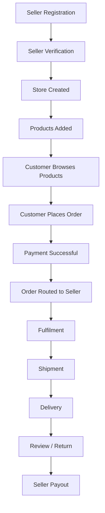

---

## Seller Onboarding Workflow

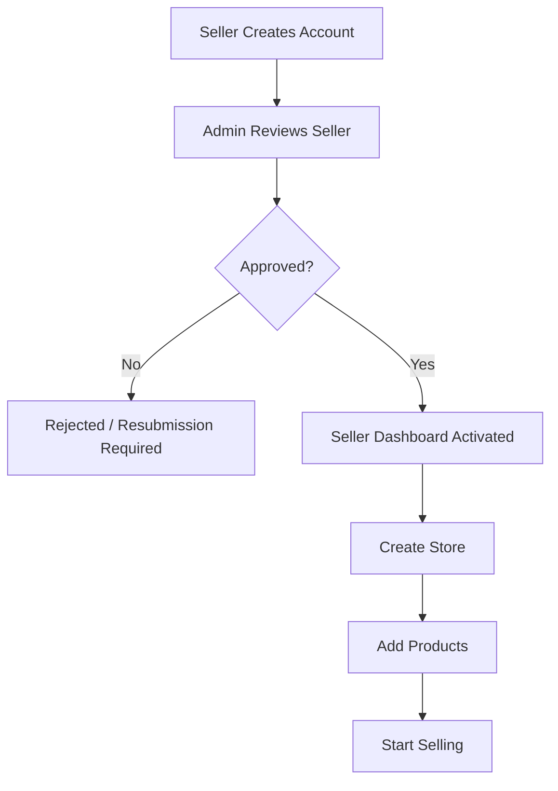

### Key Seller Steps
- Create account
- Submit verification details
- Receive admin approval
- Configure store profile
- Add and publish products

---

## Product Creation Workflow

Sellers can add products from three sources:

- **Own Product**
- **Amazon Product**
- **AliExpress Product**

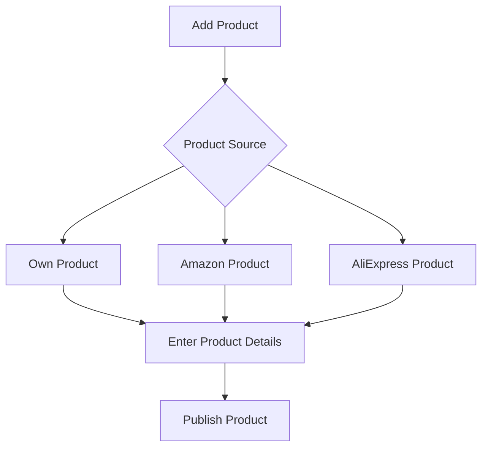

### Product Fields
- Product title
- Description
- Images
- Category
- Variants
- Selling price
- Profit margin
- Stock / availability
- Shipping details
- Return policy

---

## Product Variant Structure

Example:

```text
Nike Shoes
├── Black
│   ├── UK7
│   ├── UK8
│   └── UK9
└── White
    ├── UK7
    ├── UK8
    └── UK9
```

### Variant Data
Each variant can store:
- SKU
- Supplier SKU
- Supplier price
- Selling price
- Weight
- Stock quantity
- Barcode

---

## Customer Shopping Workflow

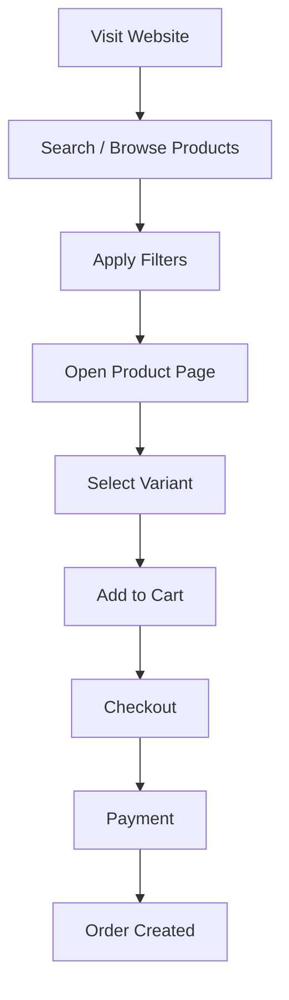

### Customer Actions
- Search products
- Filter by category, price, brand, and availability
- Select variant
- Add to cart
- Checkout securely
- Track order status

---

## Order Processing Workflow

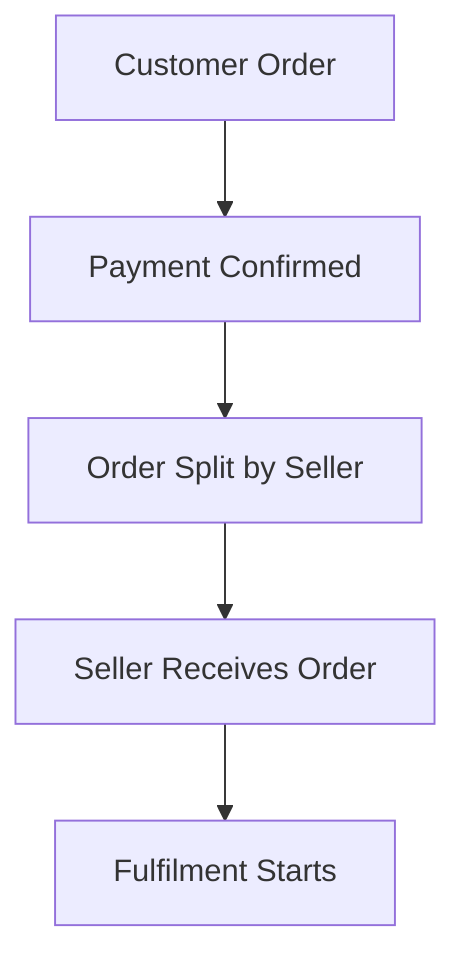

If a single checkout contains products from multiple sellers, the system automatically splits the order into separate seller sub-orders.

---

## Fulfilment Workflows

### 1) Seller-Owned Product
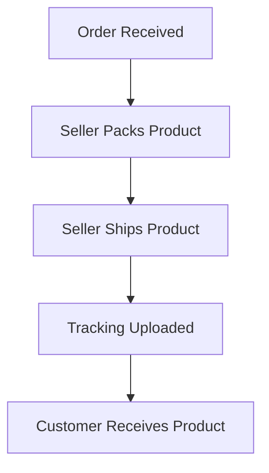

### 2) Amazon Product
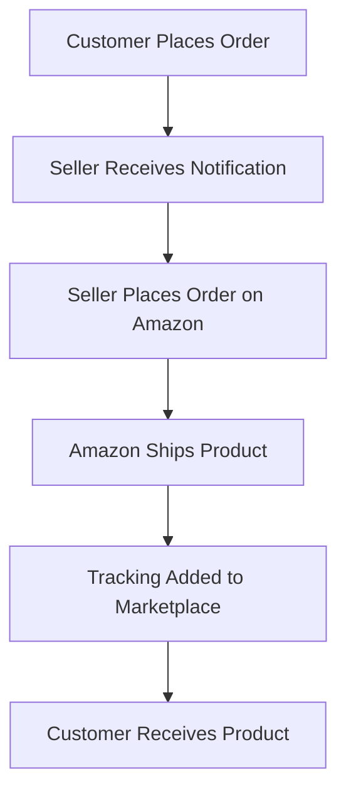

### 3) AliExpress Product
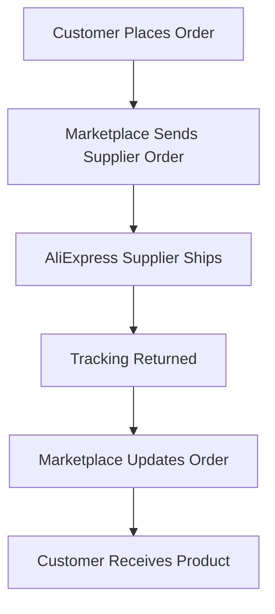

---

## Inventory Management

### Seller-Owned Products
- Marketplace maintains actual stock quantity
- Stock reduces after successful purchase
- Stock increases after approved restock or return

Example:
```text
Inventory = 100
Customer buys 2
Inventory = 98
```

### Amazon Products
- Marketplace does not manage physical inventory
- System only stores supplier mapping and availability link

### AliExpress Products
- Supplier stock can be synced
- Marketplace updates product availability based on supplier data

---

## Payment and Payout Workflow

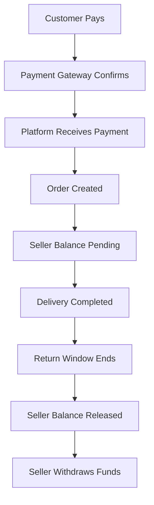

### Commission Flow
- Customer pays full order amount
- Platform deducts commission
- Seller receives net earnings
- Approved earnings move to seller wallet
- Seller requests withdrawal
- Admin approves transfer

---

## Wallet System

### Seller Wallet Balances
- Available balance
- Pending balance
- Withdrawn amount
- Total earnings

### Withdrawal Flow
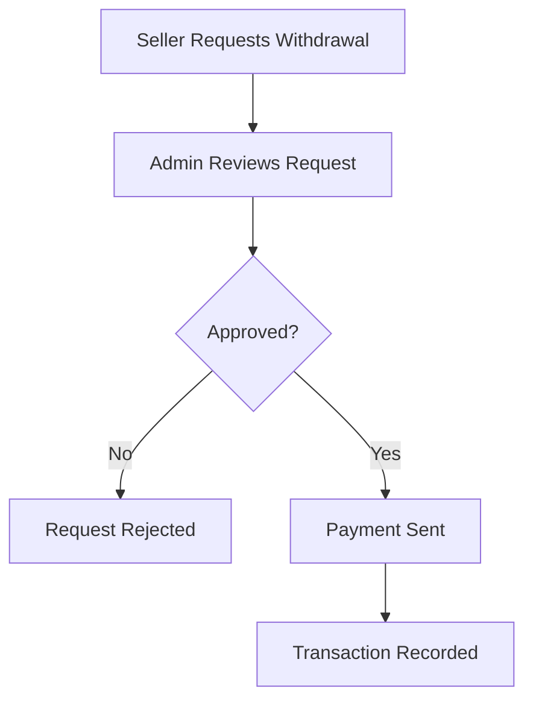

---

## Return and Refund Workflow

### Return Request
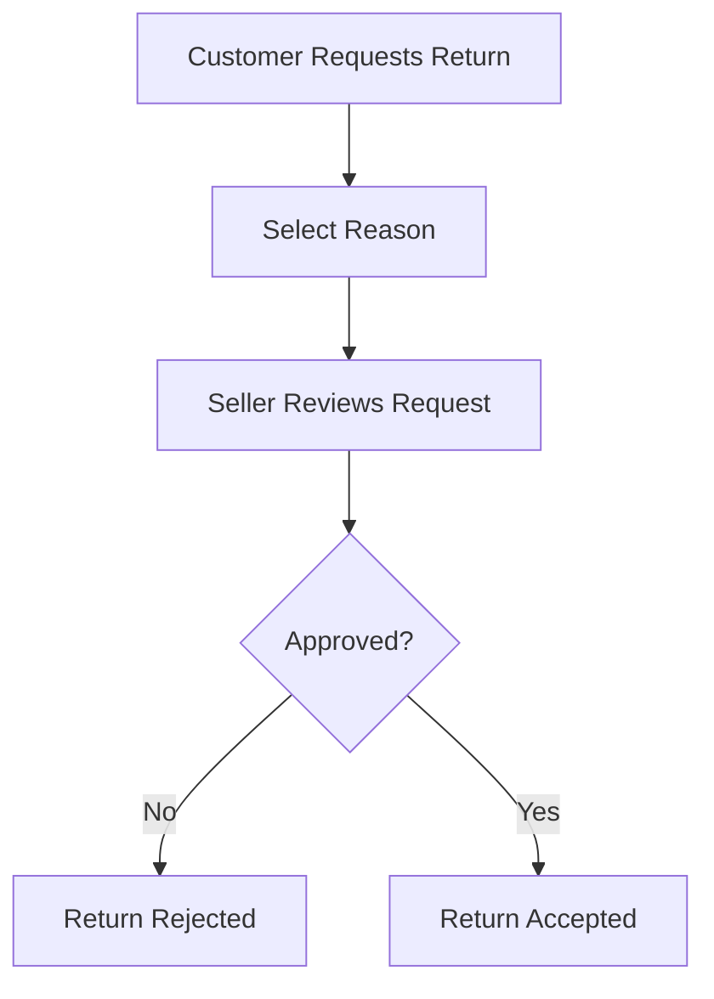

### Seller-Owned Product Return
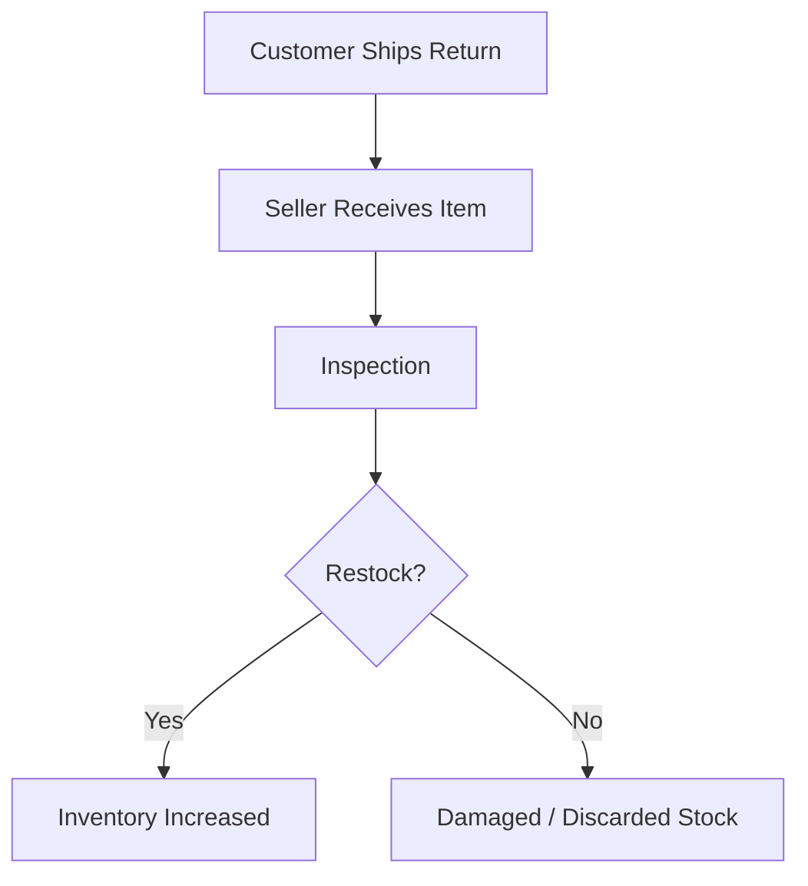

### Refund Flow
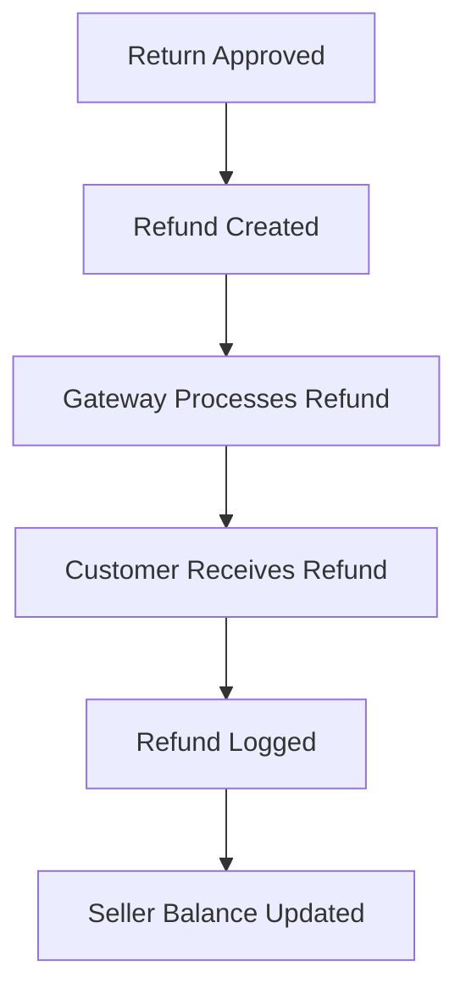

---

## Review Workflow

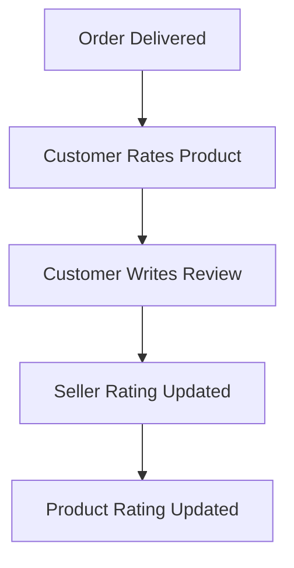

Reviews help improve trust, conversion rate, and product visibility.

---

## Notification System

### Trigger Events
- New order
- Payment success
- Shipment update
- Delivery confirmation
- Return request
- Refund processed
- New review
- Withdrawal approved

### Delivery Channels
- Email
- SMS
- Push notification
- In-app notification

---

## Admin Dashboard Responsibilities

The admin can manage:
- Sellers
- Customers
- Products
- Orders
- Categories
- Brands
- Returns
- Refunds
- Wallets
- Withdrawals
- Coupons
- Reviews
- Reports
- Settings

---

## Seller Dashboard Responsibilities

The seller can manage:
- Store profile
- Products
- Variants
- Orders
- Customers
- Wallet
- Returns
- Reviews
- Coupons
- Analytics
- Withdrawals

---

## Customer Dashboard Responsibilities

The customer can manage:
- Profile
- Addresses
- Orders
- Wishlist
- Cart
- Returns
- Refunds
- Reviews
- Notifications

---

## Supplier Mapping Structure

Each marketplace variant should map to its supplier record:

```text
Marketplace Variant
├── Supplier
├── Supplier Product ID
├── Supplier Variant ID
├── Supplier URL
└── Supplier Price
```

This mapping ensures correct fulfilment, tracking, pricing, and automation.

---

## Core Database Flow

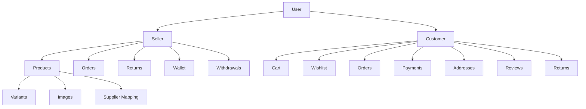

---

## Complete Marketplace Lifecycle

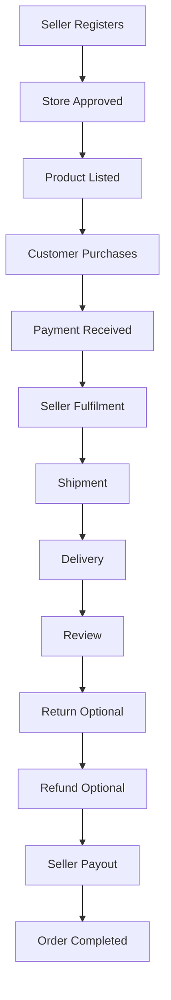

---

## Recommended Improvements for Production Use

- Use **order splitting** for multi-seller checkout
- Store **separate seller sub-orders** under one master order
- Add **commission rules** by seller or category
- Support **wallet holds** until delivery or return window expiry
- Keep **supplier mapping** at variant level, not just product level
- Track **audit logs** for approvals, refunds, withdrawals, and edits
- Add **notification templates** for every major event
- Design **status-driven workflows** for better operations control

---

## Suggested Order Statuses

```text
Pending Payment
Payment Confirmed
Processing
Partially Fulfilled
Shipped
Delivered
Return Requested
Return Approved
Refunded
Completed
Cancelled
```

---

## Suggested Seller Earnings Statuses

```text
Pending
On Hold
Available
Withdrawn
Rejected
Reversed
```

---

## Final Summary
This marketplace workflow supports a full multi-vendor commerce system with seller onboarding, product sourcing, order routing, fulfilment, shipping, returns, refunds, commissions, wallets, and dashboards. The structure is designed to scale across **seller-owned products**, **Amazon-based fulfilment**, and **AliExpress dropshipping** while keeping operations clear and trackable.

